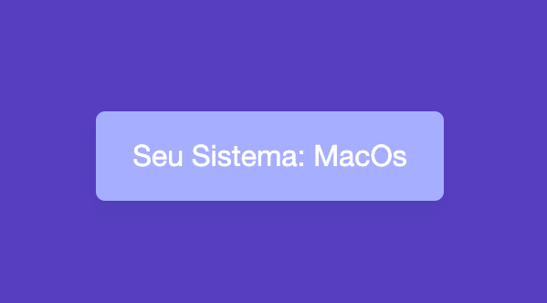

<div align="center" id="top"> 
  

  &#xa0;

  <!-- <a href="https://myos.netlify.app">Demo</a> -->
</div>

<h1 align="center">My Os</h1>

<p align="center">
  

  

  

  <!--  -->

  <!--  -->

  <!--  -->

  <!--  -->
</p>

<!-- Status -->

<!-- <h4 align="center"> 
	🚧  Myos 🚀 Under construction...  🚧
</h4> 

<hr> -->

<p align="center">
  <a href="#dart-about">About</a> &#xa0; | &#xa0; 
  <a href="#rocket-technologies">Technologies</a> &#xa0; | &#xa0;
  <a href="#memo-license">License</a> &#xa0; | &#xa0;
  <a href="https://github.com/fabramosdev" target="_blank">Author</a>
</p>

<br>

## :dart: About ##

Vanilla Javascript para detectar o seu sistema operacional


## :rocket: Technologies ##

O que foi usado no projeto:

- [Javascript](https://expo.io/)

## :checkered_flag: HTML ##

```html
<div class="card" id="os_card"></div>
```

## :checkered_flag: CSS ##

```css
body {
  display: flex;
  min-height: 100vh;
  align-items: center;
  justify-content: center;
  font-family: Roboto, "Helvetica Neue", Arial, sans-serif;
  background: #f3c4fb;
}
.card {
  background: #e2afff;
  color: #fff;
  box-shadow: 0 10px 20px 0 rgba(0, 77, 115, 0.07);
  border-radius: 10px;
  padding: 30px 40px;
  font-size: 2rem;
}
```

## :checkered_flag: Javascript ##

```javascript
const card = document.getElementById("os_card");
let os = "Unknown";

if (navigator.appVersion.indexOf("Win") != -1) os = "Windows";
if (navigator.appVersion.indexOf("Mac") != -1) os = "MacOS";
if (navigator.appVersion.indexOf("X11") != -1) os = "UNIX";
if (navigator.appVersion.indexOf("Linux") != -1) os = "Linux";

card.innerHTML = "Your OS: " + os;
```

## :memo: License ##

This project is under license from MIT. For more details, see the [LICENSE](LICENSE.md) file.


Made with :heart: by <a href="https://github.com/fabramosdev" target="_blank">Fabiano Ramos</a>

&#xa0;

<a href="#top">Back to top</a>
